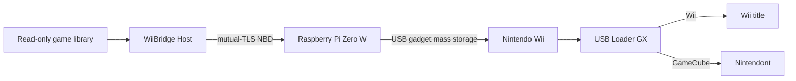

# WiiBridge

WiiBridge turns a Raspberry Pi Zero W into a direct USB storage bridge for a
Nintendo Wii. The host indexes a read-only game library, publishes it over
mutual-TLS NBD, and the Pi presents the selected storage profile to the Wii
through USB gadget mass-storage mode.

On a fresh `/data` directory, browser login is `admin` / `wiibridge`; the first
login must replace that bootstrap password. See
[Host dashboard](docs/host-dashboard.md) for authentication, aggregate
GameCube generation, Pi controls, and password recovery.

> [!IMPORTANT]
> Use backups of media you legally own. WiiBridge does not include games,
> encryption keys, certificates, administrator credentials, or Wii system
> software.

## At a glance

| Capability | Status | Notes |
| --- | --- | --- |
| Wii WBFS library | Production baseline | Source files stay in place and read-only |
| Host management dashboard | Available | HTTPS on the management network |
| Raspberry Pi Zero W bridge | Available | Direct Pi-to-Wii USB connection |
| GameCube ISO/GCM/CISO/FST | Host-tested | Separate Nintendont-compatible FAT32 export |
| GameCube emulated saves | Host-tested | Bounded individual/shared raw-card overlay |
| Host/Pi compatibility contract | Available | Fresh operation-specific capability checks |
| Offline-source reconciliation | Available | Failed scans preserve the last complete catalog |
| Performance dashboard | Available | Bounded Host/Pi counters and session summaries |
| GameCube physical-Wii acceptance | Pending | Follow the documented hardware validation gates |
| ZIP, RVZ, and NKit | Unsupported | Convert and validate these outside WiiBridge |
| USB/Ethernet HATs and hubs | Unsupported | They are not part of the design |

## How it works



Wii mode synthesizes an immutable MBR/FAT32 disk from existing WBFS files
without copying or rewriting them. GameCube mode is isolated behind a separate
export profile and synthesizes a Nintendont-compatible FAT32 disk whose file
extents read through to the original sources. Wii remains the startup default.

Large Wii volumes use 32 KiB clusters, exact primary/backup FSInfo values, and
USB Loader GX's `4 GiB - 32 KiB` virtual split boundary. WBFS directory entries
carry archive attribute `0x20`, never DOS read-only `0x01`; immutability is
enforced by the read-only NBD export and USB LUN.

## Requirements

- TrueNAS Community Edition with Custom Apps / **Install via YAML**, or a
  compatible Linux container host.
- Raspberry Pi Zero W with its USB gadget data port connected directly to the
  Wii.
- A high-quality power supply and data cable.
- A dedicated, read-only game-library dataset.
- Persistent datasets for configuration, metadata, certificates, logs, and
  backups.
- A private certificate authority, one server certificate, and a unique client
  certificate for each Pi.
- USB Loader GX on the Wii; Nintendont is additionally required for GameCube.

Do not expose ports 8445 or 10809 to the public internet.

For independent Wii and GameCube folders or recovery after moving a dataset,
see [library locations](docs/library-locations.md).

## Quick start

### 1. Prepare the host configuration

Copy the example environment file and replace every placeholder:

```sh
cp deploy/truenas/.env.example deploy/truenas/.env
```

The important settings are:

- `WIIBRIDGE_LIBRARY_PATH`: legal Wii/GameCube backups; mounted read-only.
- `WIIBRIDGE_CONFIG_PATH`, `WIIBRIDGE_DATA_PATH`, `WIIBRIDGE_LOGS_PATH`, and
  `WIIBRIDGE_BACKUPS_PATH`: writable persistent datasets.
- `WIIBRIDGE_CERTS_PATH`: read-only certificate dataset.
- `WIIBRIDGE_HTTPS_BIND`: management-LAN address for the dashboard.
- `WIIBRIDGE_NBD_BIND`: trusted Pi-facing address.
- `WIIBRIDGE_ADMIN_TOKEN`: a random value of at least 20 characters.
- `WIIBRIDGE_IMAGE`: an immutable image reference, preferably pinned by digest.

Generate and provision TLS material with the project utility:

```sh
scripts/tls-provision.sh --help
```

Never commit the resulting `.env`, private keys, or administrator token.

### 2. Validate the TrueNAS definition

```sh
deploy/truenas/preflight.sh
deploy/truenas/validate-compose.sh deploy/truenas/compose.yaml
```

Open **Apps → Discover Apps → Install via YAML**, paste the resolved Compose
definition, and verify these safety properties before installing:

- `/library` is read-only.
- `/certs` is read-only.
- privileged mode, host networking, host devices, and the Docker socket are
  absent.
- HTTPS is bound only to the management LAN.
- NBD is bound only to the trusted Pi network.

The complete procedure is in
[TrueNAS deployment](deploy/truenas/README.md).

### 3. Build and provision the Pi

Build and validate the board-specific firmware:

```sh
make firmware-zero-w
make validate-firmware
```

Read [flashing safety](docs/flashing.md) before selecting removable media, then
follow [Pi first run](docs/pi-first-run.md). Reuse this device's provisioned
certificate, identity, and authorized USB VID/PID; do not invent or regenerate
them during an upgrade.

### 4. Configure the Wii loader

For Wii titles, retain the known-working USB Loader GX and cIOS settings. For
GameCube titles:

- GameCube loader: **Nintendont**
- Nintendont path: `sd:/apps/Nintendont/boot.dol`
- GameCube source: **USB**
- Game path: `/games`
- Video mode: **Auto** or **Disc Default**
- Optional patches, widescreen, cheats, and IPL: off unless a title-specific
  test justifies them

See [USB Loader GX](docs/usb-loader-gx.md) and
[GameCube support](docs/gamecube-support.md).

### 5. Open the Host dashboard

Browse to:

```text
https://<WIIBRIDGE_HTTPS_BIND>:8445/
```

Authenticate with the configured administrator token. The dashboard provides:

- All, Wii, and GameCube library views.
- title and game-ID search.
- active export and snapshot status.
- optional authenticated one-button Wii/GameCube platform switching.
- explicitly confirmed safe Raspberry Pi reboot and shutdown controls.
- validated GameCube import and selection actions.
- per-title Nintendont compatibility settings.
- memory-card backup health and restore actions.
- Host/firmware compatibility, source availability, and end-to-end performance.

Keep the dashboard on a trusted management network.

HTTPS and `/healthz` come online before library scanning. `/readyz` remains
HTTP 503 until the Wii backend and NBD export manager are safe. GameCube deep
validation runs independently after Wii readiness when its persisted
validation receipt is missing or stale, so it cannot hold the dashboard or Wii
startup closed.

## Normal operation

### Wii

Wii is the default profile. Select a title in the existing application flow,
connect NBD on the Pi, attach the USB gadget, and launch it through USB Loader
GX. Game payloads and the Wii-facing LUN remain read-only.

### GameCube

1. Add a supported legal backup to the read-only library.
2. In the Host dashboard, confirm its ID, region, revision, format, disc count,
   and validation state.
3. Choose **Build GameCube Library**. This builds compact FAT32 metadata and a
   source extent map; it does not copy game payloads.
4. Choose **Activate GameCube Library**. The Host safely detaches USB,
   disconnects NBD, verifies the validated generation receipt and current
   source identities, selects the complete synthetic library, reconnects NBD,
   and reattaches USB.
5. Launch through USB Loader GX and Nintendont.

Supported sources are `.iso`, `.gcm`, the documented CISO/CSO mapping, extracted
FST layouts, and validated two-disc sets. Sources are never modified. Details
and exact commands are in [GameCube support](docs/gamecube-support.md).

The GameCube disk is synthetic: its apparent size includes every mapped game,
while `/data` stores only compact FAT32 metadata, manifests, extent maps, and
save data. Payload reads are served directly from the original read-only
`/library` files.

Memory-card modes are `physical`, `emulated-individual`, and
`emulated-shared`. Emulated modes make only the Host-generated raw-card extent
writable; FAT metadata and game extents remain immutable. See
[the save-overlay design](docs/gamecube-save-overlay.md).

The Wii FAT is likewise synthesized on demand instead of being retained as
millions of 512-byte heap objects. The supplied TrueNAS profile uses a 384 MiB
Go heap target inside a 512 MiB container limit, including for multi-terabyte
libraries.

## Safe platform switching

Never replace a backing store while the gadget is attached:

```text
Detach USB → disconnect NBD → select/validate profile
→ reconnect NBD → attach USB → wait for stable enumeration
```

For exact commands, use
[GameCube deployment](docs/gamecube-deployment.md). Returning to Wii mode
restores the normal read-only Wii export.

The Host can perform this sequence automatically when explicitly configured
with the Pi's pinned public management certificate and independent management
token. See
[automatic platform switching](docs/automatic-platform-switching.md).

## Build and test

```sh
make test
make static
make server
make compose
make oci
```

Firmware validation is separate:

```sh
make firmware-all
make validate-firmware
```

These host checks do not prove physical Wii compatibility. Hardware results
must be recorded using the
[hardware acceptance plan](docs/hardware-acceptance-plan.md).

## Troubleshooting

| Symptom | First checks |
| --- | --- |
| Dashboard does not open | Container health, port 8445 bind address, firewall, server certificate SAN |
| Authentication fails | `WIIBRIDGE_ADMIN_TOKEN` length/value and browser credentials |
| Pi cannot connect | Port 10809 firewall, client certificate, CA chain, clock, export name |
| Wii cannot see USB | Direct data cable, correct gadget port, Pi power, NBD connected before attach |
| Loader remains on `Initializing USB devices` | Verify the live image revision, 32 KiB geometry, and exact non-sentinel primary/backup FSInfo before changing cIOS or networking |
| Loader remains on `Loading resources` | Compare Pi NBD counters over the same interval; a finite traversal followed by fixed counters is post-enumeration guest-side state, not proof of a network bottleneck |
| Animated banner is blank | Verify live WBFS archive `0x20`, read-only clear, safe split sizes, and whether selection triggers new NBD/source reads |
| Game freezes after its menu | Correlate Wii time, USB commands, Pi NBD counters, Host source counters, and split-boundary reads; a configured gadget alone does not prove progress |
| `/dev/nbd0` is busy | Detach USB first, disconnect cleanly, inspect stale NBD ownership |
| Game is missing | Read permissions, supported extension, valid header, scan rejection reason |
| GameCube title is not playable | Finish and validate its cache; do not expose partial imports |
| Emulated save needs recovery | Keep USB detached and use the documented validated-backup restore flow |
| TLS file is empty or unreadable | Stop; restore the matching credential from backup—do not regenerate blindly |

More recovery guidance:

- [Recovery runbook](docs/recovery.md)
- [Security model](docs/security.md)
- [TrueNAS rollback](deploy/truenas/rollback.md)
- [GameCube rollback](docs/gamecube-rollback.md)

## Security and data guarantees

- The source game dataset is mandatory read-only.
- Wii and physical-card GameCube exports reject writes. Emulated GameCube
  accepts writes only inside checksummed Host-generated save extents.
- NBD requires mutual TLS; HTTPS uses a separate administrator credential.
- The container runs non-root, drops Linux capabilities, and has a read-only
  root filesystem.
- GameCube writable-save mode is explicit, isolated, validated, and backed up.
- The Pi must not mount an exported GameCube volume while the Wii owns it.
- No game payload is included in builds, tests, firmware, or this repository.

Read [the security model](docs/security.md) before deployment.

## Documentation

| Topic | Guide |
| --- | --- |
| Architecture | [docs/architecture.md](docs/architecture.md) |
| TrueNAS installation | [deploy/truenas/README.md](deploy/truenas/README.md) |
| Upgrade and rollback | [upgrade](deploy/truenas/upgrade.md) · [rollback](deploy/truenas/rollback.md) |
| Raspberry Pi setup | [docs/pi-first-run.md](docs/pi-first-run.md) |
| Automatic switching | [docs/automatic-platform-switching.md](docs/automatic-platform-switching.md) |
| Safe flashing | [docs/flashing.md](docs/flashing.md) |
| USB Loader GX | [docs/usb-loader-gx.md](docs/usb-loader-gx.md) |
| GameCube mode | [support](docs/gamecube-support.md) · [deployment](docs/gamecube-deployment.md) · [rollback](docs/gamecube-rollback.md) |
| GameCube save overlay | [docs/gamecube-save-overlay.md](docs/gamecube-save-overlay.md) |
| Host/Pi protocol | [docs/protocol.md](docs/protocol.md) |
| Source reconciliation | [docs/source-reconciliation.md](docs/source-reconciliation.md) |
| Performance dashboard | [docs/performance-dashboard.md](docs/performance-dashboard.md) |
| Hardware validation | [docs/hardware-acceptance-plan.md](docs/hardware-acceptance-plan.md) |
| Naming migration | [docs/wiibridge-rename.md](docs/wiibridge-rename.md) |

## Project status and contributing

The repository contains host-tested GameCube support, but the documented
physical GameCube acceptance matrix remains pending until those tests are
performed and recorded. Never report emulator or host-only results as physical
hardware success.

Keep changes small, preserve the Wii baseline, add regression tests for shared
code, and avoid committing credentials or copyrighted media. Start with:

```sh
make test static
git diff --check
```

Wii, GameCube, Nintendont, USB Loader GX, Raspberry Pi, and TrueNAS are names or
trademarks of their respective owners. WiiBridge is an independent project and
is not affiliated with or endorsed by Nintendo.
